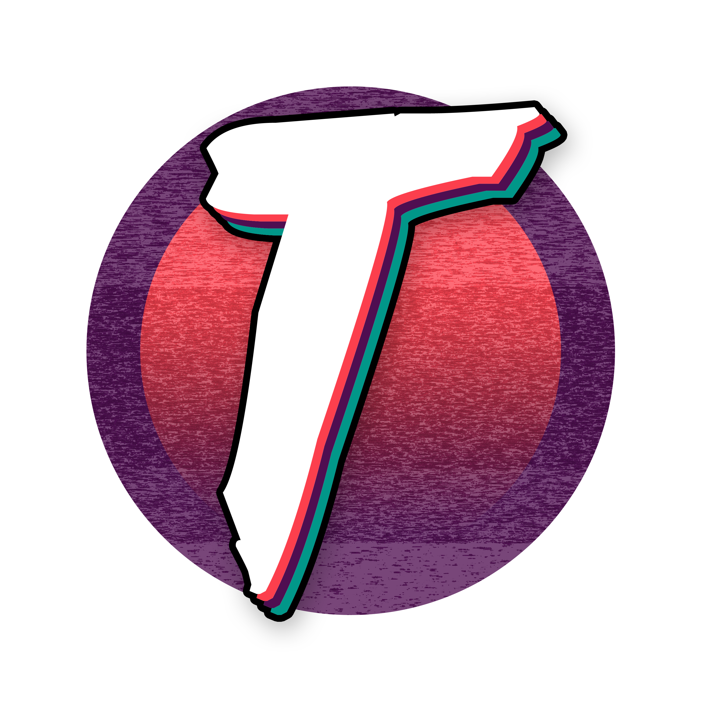

I'm Derek "Turtle" Roe. Nice to meet you! 😄

I'm a freelance consultant, content creator and streamer, software preservationist and emulation enthusiast from the US. I spend a lot of my time on free, libre, open-source software and open community projects, and you can find a lot of what I work on here on GitHub.

You can find all of my social media and ways to support me here: https://bio.link/derekturtleroe

👩‍💻 I'm currently working on Nintendo 64 emulation and preservation!

🧠 I'm currently learning MIPS assembly, N64 ROM mapping, and general RE of N64 software and firmware.

👯‍ I'm looking to collaborate on preservation and emulation projects, and other free and open-source projects.

🤔 I'm looking for help with building a Sanni dumper, and a SummerCart64.

💬 Ask me about software preservation, emulation, video game history, and other technology subjects!

📫 How to reach me: My social media is below! I am most active on Discord.

😄 Pronouns: he/him

<h3 align="center">Social media</h3>

<h3 align="center">I play games on:</h3>

        

<h3 align="center">Software I'm worked with</h3>

                                      

<h3 align="center">Languages I've worked with</h3>

<h3 align="center">Operating systems I use and develop on</h3>

<h3 align="center">Ways to financially support me and my projects</h3>

